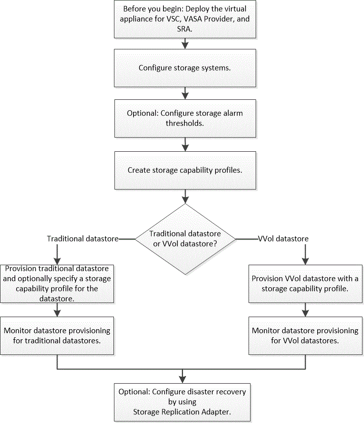

= Workflow for configuring the virtual appliance for VSC, VASA Provider, and SRA
:icons: font
:imagesdir: ../media/

[.lead]
Configuring the virtual machine for VSC, VASA Provider, and SRA involves configuring your storage systems, creating a storage capability profile, provisioning the datastore, and optionally configuring SRA for disaster recovery.

